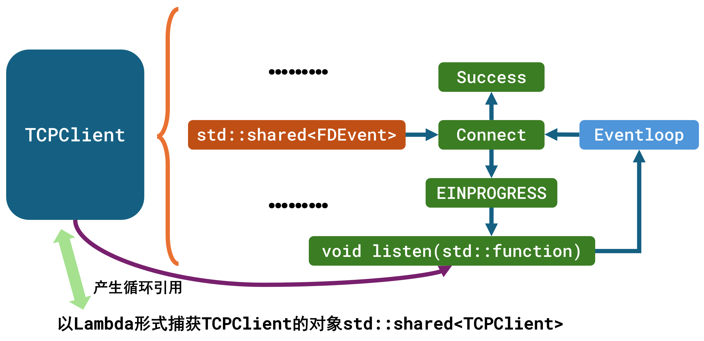

<div align="center">
<picture>
    
</picture>
</div>
<h1 align="center">
MRPC: Mini-RPC
</h1>

| [项目介绍](#项目介绍) | [安装](#安装) | [编译运行](#编译运行) | [性能测试](#性能测试) | [具体介绍](#具体介绍) | [项目问题及解决方案](#项目问题及解决方案) | [Ref](#Ref) |

## 项目介绍

本项目是参考[Rocket](https://github.com/Gooddbird/rocket)实现的一款高性能异步RPC框架, 支持HTTP与自定义MPB协议, RPC通信协议基于Protobuf。具体实现服务注册、服务发现、负载均衡、服务订阅/通知、心跳检测以及提供两种异步调用方式。

## 安装
### 1. Protobuf
```shell
wget  https://github.com/protocolbuffers/protobuf/releases/download/v3.19.4/protobuf-cpp-3.19.4.tar.gz

tar -xzvf protobuf-cpp-3.19.4.tar.gz
```
指定安装目录到`/usr/local`, 随后库文件将位于`/usr/local/lib`, 头文件位于`/usr/local/include/google`:
```shell
cd protobuf-cpp-3.19.4

./configure -prefix=/usr/local

make -j16

sudo make install
```
如果提示找不到so库, 则执行:
```shell
export LD_LIBRARY_PATH=/usr/local/lib:$LD_LIBRARY_PATH

ldconfig
```
### 2. TinyXML2
本项目引入[TinyXML2](https://github.com/leethomason/tinyxml2)头文件与源文件, 无需预先编译安装
## 编译运行
```shell
git clone https://github.com/baitianyu-kun/RPCFrame.git

cd RPCFrame

mkdir build && cd build

cmake .. && make -j16

./test_rpc_register_center_subscribe_publish // 注册中心
./test_rpc_server // 服务器
./test_rpc_channel // 客户端
```
如果要添加新的业务, 则首先编写`Service.proto`(例`order.proto`), 随后执行:  
```shell
protoc --cpp_out=./ Service.proto
```
生成`Service.pb.cc`和`Service.pb.h`文件, 随后参照示例编写业务代码即可。
## 性能测试
### 1. 使用[wrk](https://github.com/wg/wrk)测试工具
系统配置: Ubuntu-20.04, 4核4G

首先将`conf/mrpc.xml`中`protocol`更改为HTTP, 设置IO线程数, 进入到wrk目录中执行:
```shell
./wrk -t 8 -c 1000 -d 30 --latency  -s ~/RPCFrame/performance/performance.lua http://192.168.0.108:22224

-t代表并发线程数, -c表示连接数, -d表示时间(s), -s启用自定义脚本
```
如果出现: unprotected error in call to Lua API.... attempt to index local 'file' (a nil value)则调整进程最大文件描述符: ulimit -n 5000
### 2. 测试结果
|  **QPS** | **并发连接数 1000** | **并发连接数 2000** | **并发连接数 5000** | **并发连接数 10000** |
|  ----  | ----  | ---- | ---- | ---- |
| MRPC 线程池大小 **4** | **152890 QPS** | **87625 QPS** | **72118 QPS**| **79658 QPS**|
| MRPC 线程池大小 **8** | **167666 QPS** | **127249 QPS**| **93850 QPS**| **89210 QPS**|
| MRPC 线程池大小 **16** | **142748 QPS** | **101273 QPS** |**108111 QPS** | **93368 QPS**|
## 具体介绍
### 1. 整体架构
本项目共分为三种角色: 客户端、注册中心、服务端

- 客户端: RPCChannel  
  客户端作为服务的消费方, 从注册中心获取可用服务器列表并缓存。通过负载均衡策略, 客户端选择最适合的服务器提供服务。订阅服务后, 客户端会接收到注册中心的服务变化通知, 并据此重新拉取服务器列表, 实现推拉机制的结合。

- 注册中心: RegisterCenter  
  注册中心负责维护服务器列表及其存活状态, 并在服务器列表发生变化时主动通知客户端。

- 服务端: RPCServer   
  服务端提供服务接口, 在启动时向注册中心进行注册, 并定期发送心跳包确保其存活状态。

- 服务端和注册中心均采用`主从Reactor`模型。`主Reactor`负责接受新连接及处理定时任务, `从Reactor`则通过轮询方式负责每个连接的事件读写。`主从Reactor`模型的优势在于响应速度快, 且可通过增加`从Reactor`数量来高效利用系统资源。


### 2. 通信协议与请求处理
本项目引入两种协议, 包括HTTP与自定义MPB协议, MPB协议如下:
```
 +--------------------------------------------------------------------------------------+
 |  magic |  type  |  msg id len  |      msg id       |  content len  |    content      |
 +--------------------------------------------------------------------------------------+
 魔法数, uint8, 1字节
 请求类型, uint8, 1字节
 msg id len, 32位, 4字节
 msg id, char[]类型, 不固定
 content len, 32位, 4字节
 content, char[]类型, 不固定
 ```
提供的消息种类如下:
 ```C++
enum class MSGType : uint8_t {
        // 调用RPC方法后的请求与响应
        RPC_METHOD_REQUEST,
        RPC_METHOD_RESPONSE,

        // 心跳机制
        RPC_REGISTER_HEART_SERVER_REQUEST, // 注册中心向服务端发送heart pack
        RPC_REGISTER_HEART_SERVER_RESPONSE, // 服务端向注册中心回应heart pack

        // 服务注册
        RPC_SERVER_REGISTER_REQUEST, // 注册到注册中心
        RPC_SERVER_REGISTER_RESPONSE, // 注册完成后给予回应

        // 服务发现
        RPC_CLIENT_REGISTER_DISCOVERY_REQUEST, // 客户端从注册中心中进行请求
        RPC_CLIENT_REGISTER_DISCOVERY_RESPONSE, // 注册中心给客户端响应

        // 服务订阅
        RPC_CLIENT_REGISTER_SUBSCRIBE_REQUEST, // 客户端订阅相关service name
        RPC_CLIENT_REGISTER_SUBSCRIBE_RESPONSE, // 该service name中服务器列表发生变化主动通知客户端

        // 服务推送
        RPC_REGISTER_CLIENT_PUBLISH_REQUEST, // 注册中心推送消给息客户端
        RPC_REGISTER_CLIENT_PUBLISH_RESPONSE, // 客户端收到推送
        };
 ```
上述通信协议实现于抽象类`Protocol`:
```C++
class Protocol {
    public:
        using ptr = std::shared_ptr<Protocol>;

        Protocol() = default;

        virtual ~Protocol() = default;

        virtual std::string toString() = 0; // 对协议进行编码

    public:
        std::string m_msg_id; // 请求号, 唯一标识一个请求或者响应
        MSGType m_type; // 请求类型
        // 请求体中所包含的键值对,请求体中包含的数据形式为"key:value", 可替换为其他序列化协议, 例如JSON等
        std::unordered_map<std::string, std::string> m_body_data_map; 
    };
```
在进行请求处理的时候, 需要传入
```C++
Protocol::ptr request, Protocol::ptr response, Session::ptr session  
```
其中`Session`中定义了会话相关信息:
```C++
class Session {
    public:
        using ptr = std::shared_ptr<Session>;

        Session(NetAddr::ptr local_addr,
                NetAddr::ptr peer_addr) : m_local_addr(local_addr), m_peer_addr(peer_addr) {}

        ~Session() = default;

        NetAddr::ptr getLocalAddr() const { return m_local_addr; }

        NetAddr::ptr getPeerAddr() const { return m_peer_addr; }

    private:
        NetAddr::ptr m_local_addr;
        NetAddr::ptr m_peer_addr;
    };
```
参考[acid](https://github.com/zavier-wong/acid)实现请求分发, `CallBacksServlet`负责存储对应的回调函数, `DispatchServlet`将请求分发到对应的`Servlet`中
```C++
class Servlet {
    public:
        using ptr = std::shared_ptr<Servlet>;
        ...
        virtual void handle(Protocol::ptr request, Protocol::ptr response, Session::ptr session) = 0;

    private:
        std::string m_name;
};

class CallBacksServlet : public Servlet {
    public:
        using ptr = std::shared_ptr<CallBacksServlet>;
        using callback = std::function<void(Protocol::ptr request, Protocol::ptr response, Session::ptr session)>;

        explicit CallBacksServlet(callback cb) : Servlet("CallBacksServlet"), m_callback(cb) {};

        void handle(Protocol::ptr request, Protocol::ptr response, Session::ptr session) override;

    private:
        callback m_callback;
};

class DispatchServlet : public Servlet {
    public:
        using ptr = std::shared_ptr<DispatchServlet>;
        ...
        void handle(Protocol::ptr request, Protocol::ptr response, Session::ptr session) override;

        void addServlet(const std::string &uri, Servlet::ptr slt);

        void addServlet(const std::string &uri, CallBacksServlet::callback cb);

        void delServlet(const std::string &uri);

        Servlet::ptr getServlet(const std::string &uri);

    private:
        std::map<std::string, Servlet::ptr> m_all_servlets;
};
```
在使用中, 仅需要将回调函数进行注册(_1代表`std::placeholders::_1`):
```C++
// 客户端访问服务器
addServlet(RPC_METHOD_PATH, std::bind(&RPCServer::handleService, this, _1, _2, _3));
// 客户端访问注册中心
addServlet(RPC_CLIENT_REGISTER_DISCOVERY_PATH, std::bind(&RegisterCenter::handleClientDiscovery, this, _1, _2, _3));
```
如果服务器和客户端部署在同一台机器, 则可以使用`Unix`协议簇通信, `Unix`域套接字仅负责数据复制, 而不进行协议处理, 无需添加或删除网络报头, 也无需计算校验和、生成序列号或发送确认报文。和`TCP`协议簇不同, `Unix`协议簇不使用IP+端口的形式, 而是绑定一个本地文件路径。
```C++
unlink("/tmp/mysock12"); // 使用前删除旧文件

auto local_addr = std::make_shared<mrpc::UnixDomainSocketAddr>("/tmp/mysock12"); // 注册本地地址

class UnixDomainSocketAddr : public NetAddr {
    public:
        using ptr = std::shared_ptr<UnixDomainSocketAddr>;

        explicit UnixDomainSocketAddr(const std::string &path); // 构造函数，接受一个文件系统路径作为参数

        explicit UnixDomainSocketAddr(sockaddr_un addr);

        sockaddr *getSockAddr() override; // 返回 sockaddr 结构体指针

        socklen_t getSockAddrLen() override; // 返回 sockaddr 结构体的长度

        int getFamily() override; // 返回地址族（对于 Unix Domain Socket 是 AF_UNIX）

        std::string toString() override; // 返回地址的字符串表示形式

        std::string getStringIP() override; // Unix Domain Socket 没有 IP 地址，返回m_path

        std::string getStringPort() override; // Unix Domain Socket 没有端口号，返回空字符串

        bool checkValid() override;

    private:
        std::string m_path;
        sockaddr_un m_addr;  // Unix Domain Socket 地址结构体
    };
```

### 3. 服务注册
每台服务器在启动时均会向注册中心注册提供的服务名以及地址端口等, 注册中心维护一个服务名到服务器列表的映射, 同时还需要维护服务器在线状态, 将在心跳检测部分提到:
```C++
// {Order:{Server1, Server2...}}
std::unordered_map<std::string, std::set<std::string>> m_service_servers; 
```
### 4. 服务发现
由于RPC项目多为分布式项目, 因此需要注册中心来记录所有服务器信息, 客户端通过访问注册中心来获取所有提供该服务的服务器列表。在客户端启动时, 如果本地服务器列表为空, 则向注册中心发出请求。
```C++
if (m_service_servers_cache.empty()) {
    serviceDiscovery(method->service()->full_name());
}
```
### 5. 负载均衡
客户端从注册中心获取到服务器列表后, 由负载均衡策略选取最为合适的服务器。常见负载均衡策略有随机、轮询和一致性哈希。在这里采用一致性哈希策略。为防止"雪崩"问题, 引入虚拟节点, 每个虚拟节点都会关联到一个真实节点, 使得整个哈希环上节点均匀分布。
```C++
class ConsistentHash {
    public:
        using ptr = std::shared_ptr<ConsistentHash>;

        ConsistentHash() {};

        ~ConsistentHash() { serverNodes.clear(); };

        void addNewPhysicalNode(const std::string &nodeIp, int virtualNodeNum);

        void deletePhysicalNode(const std::string &nodeIp);

        std::string getServerIP(const std::string &key);

        NetAddr::ptr getServer(const std::string &key);

    public:
        static NetAddr::ptr toIPNetAddr(std::string &ip_and_port);

    private:
        // 只存储虚拟节点, key 是哈希值, value 是机器的 ip 地址
        std::map<uint32_t, std::string> serverNodes;
        // 每个机器节点关联的虚拟节点个数
        std::unordered_map<std::string, int> physicalServerAndVirtualNodeNum;
    };
```
客户端为每个服务设置一个哈希环, 在进行选择时, 首先获取自身的`IP`, 根据自身的`IP`去计算应当被哈希环上的哪个节点被处理:
```C++
auto local_ip = getLocalIP();
auto server_addr = m_service_balance[method->service()->full_name()]->getServer(local_ip);   
```
### 6. 服务订阅/通知
当服务器下线或者上线时, 需要及时通知订阅了该服务的客户端更新缓存。  
比较常见的有推和拉两种模式, 前者是注册中心负责推送, 后者是客户端以一个固定的轮询时间向注册中心拉取更新。在这里采用推拉结合的方式, 当服务器上线或者下线, 注册中心返回一个通知, 客户端收到该通知后重新拉取服务器列表。使用推拉结合的优点就是推的消息较为轻量, 减轻注册中心压力, 同时扩展简单, 无需根据具体业务场景定义推送内容, 支持较多场景。
```C++
// 客户端去执行订阅
void RPCChannel::subscribe(const std::string &service_name) {
        ... // 访问注册中心订阅接口
        // 订阅后注册PublishListener监听器, 负责接收推送消息
        m_publish_listener = std::make_shared<PublishListener>(register_client->getLocalAddr(),
                                                               std::bind(&RPCChannel::handlePublish,
                                                                         this, _1, _2, _3),
                                                               m_protocol_type);
    }

// 注册中心收到订阅信息, 维护一个客户端列表, 用来做推送, key：订阅的服务名, value：客户端地址
std::unordered_map<std::string, std::set<std::string>> m_service_clients;

// 当服务器超时或者重新上线时, 推送消息
void RegisterCenter::publishClientMessage(body_type body, NetAddr::ptr client_addr);

// 客户端处理推送消息
void RPCChannel::handlePublish(Protocol::ptr request, Protocol::ptr response, Session::ptr session) {
        serviceDiscovery(service_name); // 收到服务器通知后重新请求服务信息, 推拉结合
        ...
    }
```
```C++
// PublishListener中启动一个监听线程
class PublishListenerRunner {
    public:
        using ptr = std::shared_ptr<PublishListenerRunner>;

        using callback = std::function<void(Protocol::ptr request, Protocol::ptr response, Session::ptr session)>;

        explicit PublishListenerRunner(NetAddr::ptr local_addr, ProtocolType protocol_type = ProtocolType::HTTP_Protocol);

        ~PublishListenerRunner();

        void addServlet(const std::string &uri, Servlet::ptr slt);

        void addServlet(const std::string &uri, CallBacksServlet::callback cb);

        void start();

    private:
        void init();

        void onAccept();

    private:
        NetAddr::ptr m_local_addr;
        TCPAcceptor::ptr m_acceptor;
        EventLoop::ptr m_main_event_loop;
        FDEvent::ptr m_listen_fd_event;
        RPCDispatcher::ptr m_dispatcher;
        TCPConnection::ptr m_connection;
        ProtocolType m_protocol_type;
    };

    class PublishListener {
    public:
        using ptr = std::shared_ptr<PublishListener>;

        using callback = std::function<void(Protocol::ptr request, Protocol::ptr response, Session::ptr session)>;

        PublishListener(NetAddr::ptr local_addr, callback call_back, ProtocolType protocol_type = ProtocolType::HTTP_Protocol);

        ~PublishListener();

    private:
        static void *runner(void *arg);

        PublishListenerRunner::ptr getPublishListenerRunner() const { return m_runner; };

    private:
        pid_t m_thread_id{-1};
        pthread_t m_thread{0};
        NetAddr::ptr m_local_addr;
        callback m_callback; // 接收到注册中心的推送后需要执行的方法, 由channel进行绑定
        PublishListenerRunner::ptr m_runner;
        ProtocolType m_protocol_type;
    };
```

### 7. 心跳检测
注册中心需要维护服务器的在线状态, 当出现服务器掉线或者上线, 需要推送给客户端, 使客户端及时更新服务器缓存列表。在服务注册以后, 注册中心为每个服务器设置定时器, 服务器定时向注册中心发送心跳包, 注册中心收到后将重新开始计时, 如果超时没有收到心跳包, 则从缓存中删除该服务器, 并通知已经订阅的客户端。
```C++
// 服务注册后设置定时器
Timestamp timestamp(addTime(Timestamp::now(), SERVER_TIME_OUT_INTERVAL));
auto new_timer_id = getMainEventLoop()->addTimerEvent(
            [server_addr, this]() { this->serverTimeOut(server_addr); }, timestamp, 0);
m_servers_timer_event.emplace(server_addr->toString(), new_timer_id);

// 收到心跳包后, 返回给心跳包, 并重新设置定时器
getMainEventLoop()->deleteTimerEvent(m_servers_timer_event[server_addr_str]);
Timestamp timestamp(addTime(Timestamp::now(), SERVER_TIME_OUT_INTERVAL));
auto new_timer_id = getMainEventLoop()->addTimerEvent(
            [server_addr, this]() { this->serverTimeOut(server_addr); }, timestamp, 0);
m_servers_timer_event[server_addr_str] = new_timer_id;

// 超时后从缓存中删除, 并推送给客户端
getMainEventLoop()->deleteTimerEvent(m_servers_timer_event[server_addr_str]);
m_servers_timer_event.erase(server_addr_str);
auto time_out_services = m_servers_service[server_addr_str];
m_service_servers[service].erase(server_addr_str); 
notifyClientServiceUnregister(service); // 通知客户端, 该服务器提供的这些服务均已过期
```
### 8. 异步调用方式
本项目提供了两种异步调用方式, 一种是通过传入回调函数, 另一种是使用`future`和`promise`封装异步操作(_1代表`std::placeholders::_1`):
- 使用回调函数
```C++
channel->callRPCAsync<makeOrderRequest, makeOrderResponse>(
            std::bind(&Order_Stub::makeOrder, &stub, _1, _2, _3, _4),
            request_msg,
            [](std::shared_ptr<makeOrderResponse> response_msg) {
                if (response_msg->order_id() == "20230514") {
                    INFOLOG("========= Success Call RPC By Async ==============");
                }
            }
    );
```
```C++
template<typename RequestMsgType, typename ResponseMsgType>
void callRPCAsync(
        std::function<void(RPCController *, RequestMsgType *, ResponseMsgType *, RPCClosure *)> call_method,
        std::shared_ptr<RequestMsgType> request_msg,
        std::function<void(std::shared_ptr<ResponseMsgType>)> response_msg_call_back) {
            ...
            auto closure = std::make_shared<RPCClosure>(
                    [request_msg, response_msg, controller, response_msg_call_back]() mutable {
                        if (controller->GetErrorCode() == 0) {
                            if (response_msg_call_back) {
                                response_msg_call_back(response_msg);
                            }
                        } else {
                            if (response_msg_call_back) {
                                response_msg_call_back(nullptr);
                            }
                        }
                    });
            ...
        }
```
- 使用`future`, 即将上述方法中回调函数部分更改为设置`promise`的值:
```C++
auto future = channel->callRPCFuture<makeOrderRequest, makeOrderResponse>(
            std::bind(&Order_Stub::makeOrder, &stub, _1, _2, _3, _4),
            request_msg);
auto response_msg = future.get();
if (response_msg->order_id() == "20230514") {
    INFOLOG("========= Success Call RPC By Future ==============");
}
```
```C++
template<typename RequestMsgType, typename ResponseMsgType>
std::future<std::shared_ptr<ResponseMsgType>> callRPCFuture(
        std::function<void(RPCController *, RequestMsgType *, ResponseMsgType *, RPCClosure *)> call_method,
        std::shared_ptr<RequestMsgType> request_msg) {
            auto promise = std::make_shared<std::promise<std::shared_ptr<ResponseMsgType>>>();
            auto future = promise->get_future();
            callRPCAsync<RequestMsgType,ResponseMsgType>(call_method, request_msg, [promise](std::shared_ptr<ResponseMsgType> response_msg) {
                if (response_msg) {
                    promise->set_value(response_msg);
                } else {
                    promise->set_exception(std::make_exception_ptr(std::runtime_error("error response_msg")));
                }
            });
            return future;
        }
```

## 项目问题及解决方案
<div align="center">
<picture>
    
</picture>
</div>  


如上图所示, 在类`TCPClient`中有一个成员`shared_ptr<FDEvent>`, 该类用于设置`Epoll`所监听的事件。在`TCPClient`进行`::connect`过程中, 在非阻塞I/O下`::connect`函数有可能第一次返回-1(Unix协议簇下使用`::connect`直接连接成功返回0), 这时如果`errno == EINPROGRESS`的话代表连接正在进行中, 随后仅需要在`Epoll`中监听写, 并使用`FDEvent`捕获外面的回调函数。如果可写则证明连接成功, 继续在`Epoll`内执行`::connect`方法, 随后执行`FDEvent`中所捕获的回调函数。  

但是由于在回调函数中捕获了`TCPClient`的智能指针, 引用计数+1, 导致`TCPClient`中的`FDEvent`捕获了其自身, 处于相互拥有的状态, 即循环引用。该情况导致`TCPClient`无法析构, 其无法析构导致`TCPClient`中的`client fd`无法被`close`, 导致客户端文件描述符和内存泄露。同时在服务端, 由于客户端无法`close client fd`, 使得客户端无法主动关闭连接并发送`FIN`报文, 造成服务端无法被动关闭连接, 造成服务端描述符和内存泄露。  

解决方法: 
1. 在执行`connect`方法时仅捕获`TCPClient`的`shared_ptr`引用, 无需担心`TCPClient`指针提前于回调函数析构, 因为只要`FDEvent`对象存在则`TCPClient`就不会析构。
```C++
client->connect([this_channel, request_protocol, &client]() {});
```
2. 在执行`connect`方法时捕获`TCPClient`的弱引用。
```C++
auto this_channel = shared_from_this();
std::weak_ptr<TCPClient> weak_client(client);
client->connect([this_channel, request_protocol, weak_client]() {
       if (auto client = weak_client.lock()){
                // do something
            }
       });
```

## Ref
由于该项目尚未经过充分的测试, 因此不适合在生产环境中使用。
| Project        | Link                                                       |
|----------------|------------------------------------------------------------|
| Rocket         | https://github.com/Gooddbird/rocket               |
| TinyRPC        | https://github.com/Gooddbird/tinyrpc             |
| acid           | https://github.com/zavier-wong/acid                |
| tnl            | https://github.com/Shangyizhou/A-Tiny-Network-Library|
| muduo          | https://github.com/chenshuo/muduo                  |
| protobuf       | https://github.com/protocolbuffers/protobuf    |
| tinyxml2       | https://github.com/leethomason/tinyxml2        |
